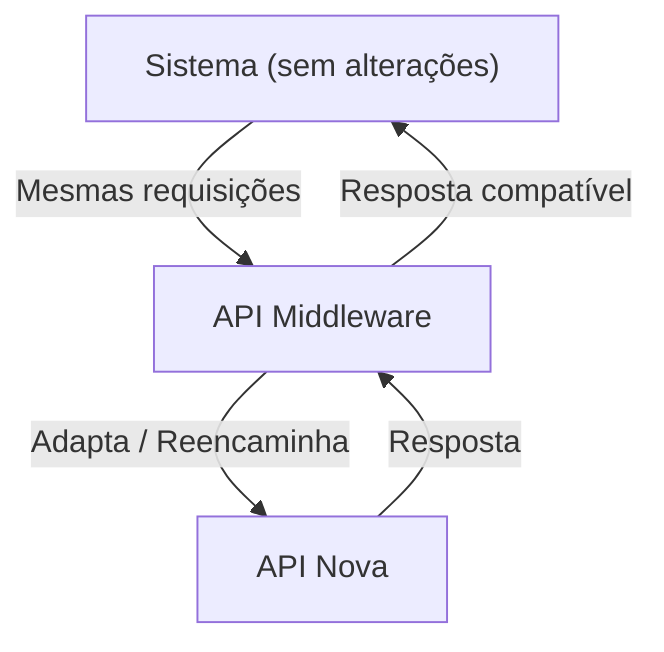
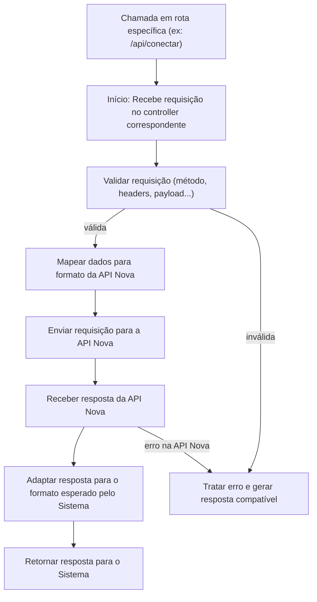

# Visão Geral da Integração

# Fluxograma da Integração

Etapas explicadas rapidamente:
Validação: Confere se a requisição tem estrutura válida.

Mapeamento: Traduz caminhos, parâmetros, headers ou payloads para o formato que a API Nova entende.

Comunicação: Faz a chamada para a API Nova.

Adaptação da resposta: Reformata dados da API Nova para que o "Sistema" receba uma resposta familiar.

Tratamento de erros: Garante que erros da API Nova não "vazem" para o Sistema de forma inesperada.

